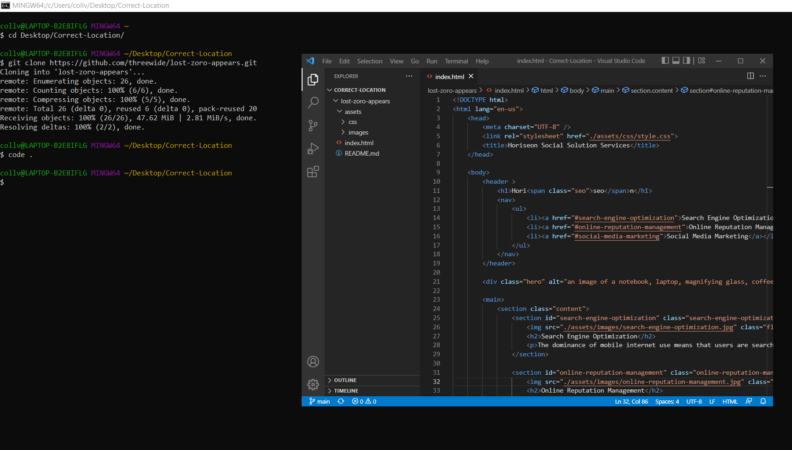

# <01-Module>

## Description

For the 01-Module project we were given a website for Horiseon Social Solution Services and had the task of making it more accesible.
The given website was mostly functional but had much room for improvement. And despite my best efforts I'm sure it still has ways for improvement.
To refactor the codde and make it more accessible I changed out many div tags with appropriate html tags like nav, header, footer and section. 
Another way to refactor code was to consolidate the selectors in the css sstyle sheet. This was where I learned the most how much redundancy can occur, and I still feel there is much to learn.
Adding alt attributes for the images is another way to make the site more accesible.
While looking through the site I noticed the Search Engine Optimization link was not working so fixed it.

## Table of Contents (Optional)

If your README is long, add a table of contents to make it easy for users to find what they need.

- [Installation](#installation)
- [Usage](#usage)
- [Credits](#credits)
- [License](#license)

## Installation

To setup the project on your computer follow these steps:

1. open terminal command and navigate to the desired directory for the repository with the command cd
2. use the command "git clone https://github.com/threewide/lost-zoro-appears.git" to create a clone of the respository on your local machine
2. use the command "code ." to open in VS Code

```md

```

## Usage

Provide instructions and examples for use. Include screenshots as needed.

To add a screenshot, create an `assets/images` folder in your repository and upload your screenshot to it. Then, using the relative filepath, add it to your README using the following syntax:

    ```md
    
    ```

## Credits

List your collaborators, if any, with links to their GitHub profiles.

If you used any third-party assets that require attribution, list the creators with links to their primary web presence in this section.

If you followed tutorials, include links to those here as well.

## License

The last section of a high-quality README file is the license. This lets other developers know what they can and cannot do with your project. If you need help choosing a license, refer to [https://choosealicense.com/](https://choosealicense.com/).

---

🏆 The previous sections are the bare minimum, and your project will ultimately determine the content of this document. You might also want to consider adding the following sections.

## Badges


Badges aren't necessary, per se, but they demonstrate street cred. Badges let other developers know that you know what you're doing. Check out the badges hosted by [shields.io](https://shields.io/). You may not understand what they all represent now, but you will in time.

## Features

If your project has a lot of features, list them here.

## How to Contribute

If you created an application or package and would like other developers to contribute it, you can include guidelines for how to do so. The [Contributor Covenant](https://www.contributor-covenant.org/) is an industry standard, but you can always write your own if you'd prefer.

## Tests

Go the extra mile and write tests for your application. Then provide examples on how to run them here.